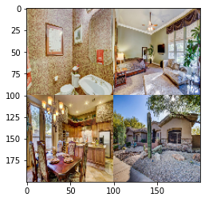
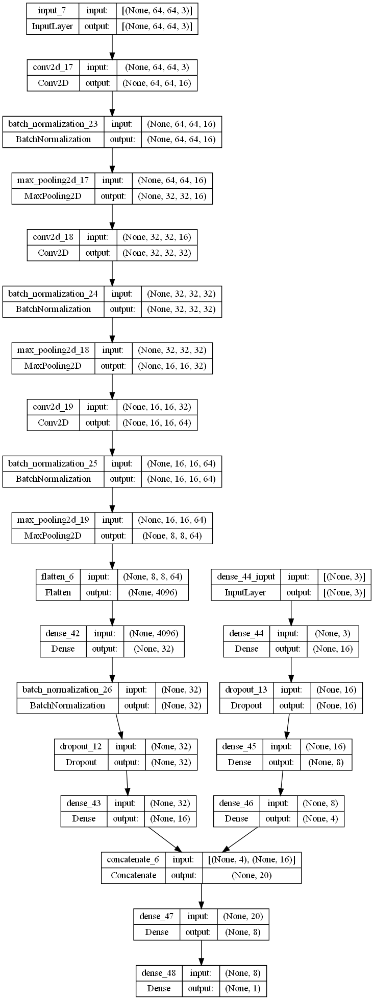

# House Price Estimation From Visual and Textual Features
House price estimation from visual and textual features using multi-channel CNN

[Dataset](https://github.com/emanhamed/Houses-dataset)

[Paper](https://arxiv.org/pdf/1609.08399.pdf)

## Contents
### Data Understanding
We have 2 datasets here. One is textual and the other is visual.

First dataset is the textual one. There are 4 features and 1 target and also 535 rows.
* Number of bedrooms
* Number of bathrooms
* Area
* Zipcode
* Price (target)

Second dataset is the visual one. Each house has 4 images from bathroom, bedroom, frontal and kitchen.

### Data Representation
We use the textual data as the same, but for the visual data we use a 64 * 64 matrix to represent images. We divide the matrix into 4 parts and each part consist one image.

* 

### Data Preprocessing
* Standard scaling for textual data
* Min-Max scaling for the target

### Modeling
We use the following multi-channel CNN

### Evaluation
0.35 r2 score is achieved
